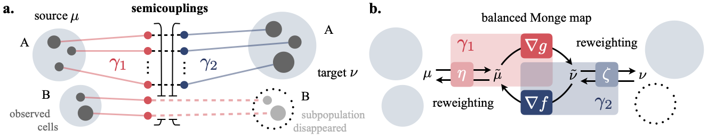

# Neural Unbalanced Optimal Transport for Modeling Single-Cell Dynamics

Master's Thesis by Frederike Lübeck

Advised by: Charlotte Bunne, David-Alvarez Melis, Andreas Krause

## Overview
<p align='center'> </p>

**a.** A semi-coupling pair ( $\gamma_1$, $\gamma_2$ ) consists of two couplings that together solve the unbalanced OT problem. Intuitively, $\gamma_1$ describes where mass goes as it leaves from $\mu$, and $\gamma_2$ where it comes from as it arrives in $\nu$. **b.** NubOT parameterizes the semi-couplings ( $\gamma_1$, $\gamma_2$ ) as the composition of reweighting functions $\eta$ and $\zeta$ and the dual potentials $f$ and $g$ between the then balanced problem.

Abstract.

## Installation

To setup the environment, run the following commands:

```
conda create -y --name nubot python=3.8.5
conda activate nubot

conda install -y -c conda-forge jaxlib
conda install -y -c conda-forge jax

pip install -r requirements.txt

pip install -e .
```

The pre-processed data files can be downloaded [here](https://drive.google.com/drive/folders/1tgsMD61ZTsUKy4C5flwct0i7BMlepAVL?usp=share_link).

## Running Model

NubOT and the baselines can now be trained by running the script ```python scripts/run_model.py``` by specifying the following command line parameters:

- `--config_model`: Model configuration file, i.e., one of the `.yaml` files in `config/models/`
- `--config_data`: Data configuration file, i.e., one of the `.yaml` files in `config/data/`
- `--target` *(optional)*: Target drug when using the cell data, e.g., `cisplatin`
- `--restart`*(optinoal)*: If this flag is set, the model restarts from scratch. Otherwise, the model is loaded from a previous checkpoint, if existent.
- `--experiment_name`,  `--experiment_dir` and `--outdir` can be provided to save the outputs in specific folders.

For example, the command for training NubOT on the cell data at 8h for the drug cisplatin is:

```
python scripts/run_model.py --config_model ./config/models/cell_nubot/submission_base.yaml --config_data ./config/data/4i-8h-raw.yaml --target cisplatin --restart
```
